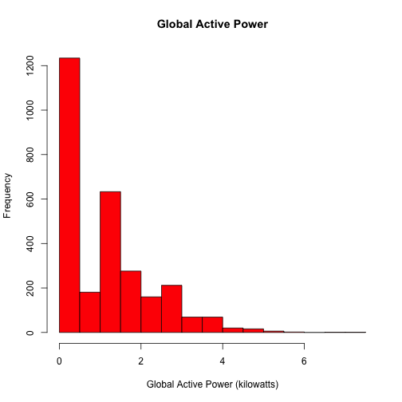

# Exploratory Data Analysis - Course Project 1

## Introduction

This repository is a course project for the Exploratory Data Analysis Course on
Coursera. This is the first course project of the two projects that are part of this course.

## Data used for this assignment
This assignment uses data from
the <a href="http://archive.ics.uci.edu/ml/">UC Irvine Machine
Learning Repository</a>, a popular repository for machine learning
datasets. In particular, the "Individual household
electric power consumption Data Set" is used. More  information about the data 
may be found in the the <a href="CodeBook.md">CodeBook.md</a> in the root of this repository.

## Scope of the assignment
The scope of the assignment is to produce four exploratoy plots in png formats showing
various variables of Energy Power Consumption during a two day period.
Examples of how the plots should look can be found at the bottom of this document.

## Files and directories in the repository
* figure directory - contains the four example plots in png format displayed at the bottom of this document
* data directory - contains a zip archive with the source data for the assignment
* CodeBook.md - info about the date, files used to get the data, transformations and variables
* plot1.R - R code used to produce the first plot, plot1.png
* plot2.R - R code used to produce the second plot, plot2.png
* plot3.R - R code used to produce the third plot, plot3.png
* plot4.R - R code used to produce the fourth plot, plot4.png
* README.md - this file
* plot1.png, plot2.png, plot3.png, plot4.png

## Explanation about the R scripts

The scripts has also followed the guidelines of the Getting and Cleaning Data course.
A tidy data set is created and one redundant colums has been removed.

All the four scripts have the same structure. The only differ in the last part which produces the plot.
The scripts have the following parts:

* Load libraries - dplyr is used for subsetting
* Setting system locale to english to display English labels for weekdays (deafault locale on my machine is Croatian)
* Unzipping of the data file
* Reading in the data
* Tidying and formating data
* Subsetting
* Plotting and outputing to png format

## Example Plots
### Example Plot 1

 

### Example Plot 2

 

### Example Plot 3

  

### Example Plot 4

  

## Acknowledgements
This assignment uses data from
the <a href="http://archive.ics.uci.edu/ml/">UC Irvine Machine
Learning Repository</a>